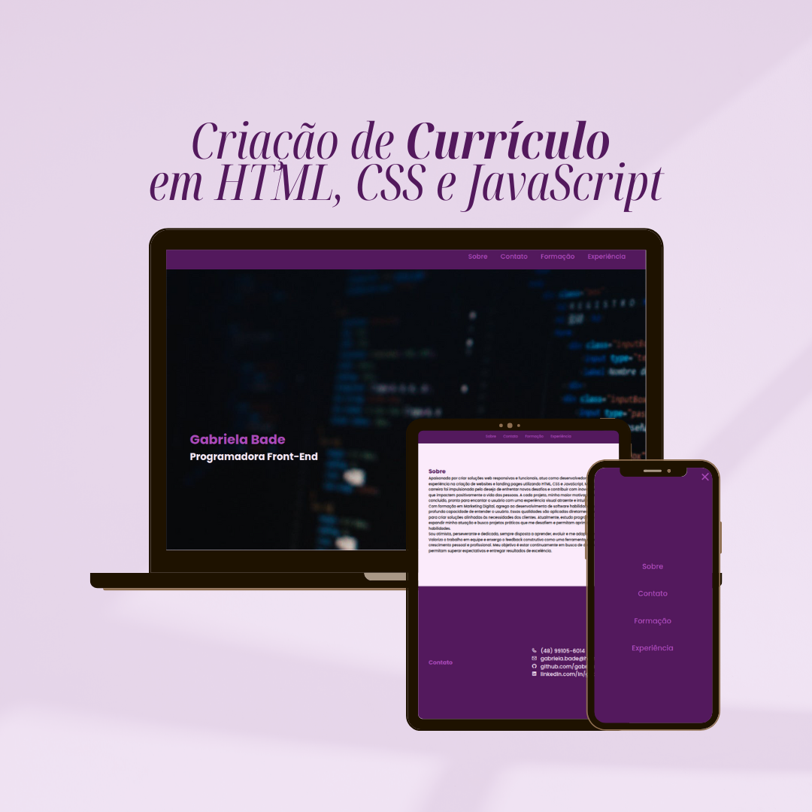

# Currículo Gabriela Bade 🖥️

Este projeto é uma **Landing Page** criada com **HTML**, **CSS** e **JavaScript**, com foco em demonstrar habilidades em estruturação semântica, estilização responsiva e interação básica com o DOM. A página foi projetada para apresentar o currículo de Gabriela Bade, destacando suas experiências, formações, habilidades e informações de contato.

---

## 📄 Descrição do Projeto

A landing page funciona como um portfólio interativo, apresentando:

- Informações sobre a desenvolvedora.
- Experiências profissionais e formações acadêmicas.
- Habilidades técnicas (hard skills).
- Formas de contato, incluindo links diretos para WhatsApp, LinkedIn, GitHub e e-mail.

Além disso, a página inclui um menu responsivo com funcionalidade para dispositivos móveis.

---

## 🚀 Funcionalidades

- **Design Responsivo**: Compatível com desktops, tablets e dispositivos móveis.
- **Menu Interativo**: Menu funcional em dispositivos móveis.
- **Botão de Retorno ao Topo**: Acesso rápido ao início da página.
- **Navegação Suave**: Scroll suave entre as seções.
- **Estilização Personalizada**: Cores temáticas e tipografia moderna.
- **Links Interativos**: Acesso direto às plataformas de contato.

---

## 🛠️ Tecnologias Utilizadas

- **HTML5**: Estrutura semântica e acessível.
- **CSS3**: Estilização moderna com responsividade.
- **JavaScript**: Interatividade e manipulação do DOM.

---

## 🌐 Deploy

Acesse o projeto clicando no link abaixo:  
[Currículo Gabriela Bade](https://gabrielabade.github.io/curriculum/)

---

## 📸 Prévia do Projeto  

